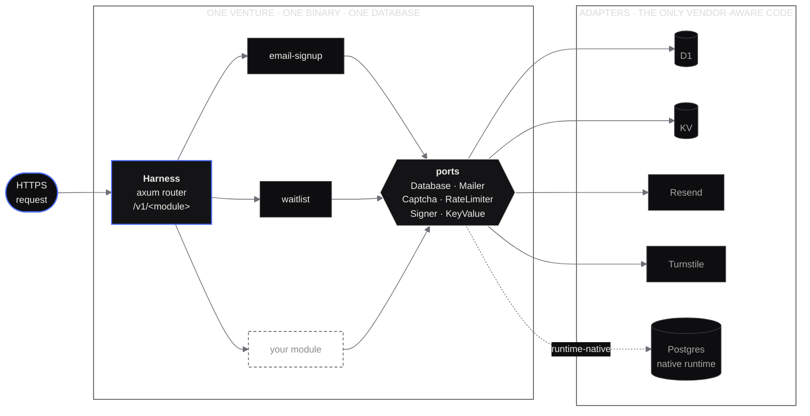

<p align="center">
  
</p>

<p align="center">
  
  
  
  
  
  
</p>

<p align="center">
  <a href="https://github.com/Cratefield/harness/actions/workflows/parity.yml">
    
  </a>
</p>

<p align="center">
  <b>cratefield.com</b> · HARNESS · the open-source core
</p>

---

# The harness

Every product needs a backend, and almost none of them should be built from
scratch. This is that backend, once.

A **Rust** harness you compile your own backend from: pick module crates, wire
adapters, ship **one stateless Worker with its own database**. Cloudflare D1
today, a self-hosted native binary later, with no module rewrites in between.

This repository is the open-source core, MIT, and it is complete enough to run
yourself today. [Cratefield](https://cratefield.com) is the managed service
being built on top of it: builds, migrations, secrets, domains and monitoring,
so you do not have to operate any of it. That service is not built yet, and the
site says so on every page.

> **Modules only see ports.**
> A module never touches a Cloudflare binding, an environment variable, or a
> vendor client. It asks for a `Database`, a `Mailer`, a `Captcha`. Adapters
> answer. That one rule is what makes the later move off Cloudflare a change of
> a single runtime crate.

Read [docs/ARCHITECTURE.md](https://github.com/Cratefield/harness/blob/main/docs/ARCHITECTURE.md) for the full design.
Decisions, including why the TypeScript attempt was thrown away, are in
[docs/adr](https://github.com/Cratefield/harness/blob/main/docs/adr). Security controls and reporting:
[docs/SECURITY.md](https://github.com/Cratefield/harness/blob/main/docs/SECURITY.md). What we store and for how long:
[docs/PRIVACY.md](https://github.com/Cratefield/harness/blob/main/docs/PRIVACY.md). Which module version runs on which
core: [docs/COMPATIBILITY.md](https://github.com/Cratefield/harness/blob/main/docs/COMPATIBILITY.md), generated and
drift-checked in CI. How crates reach crates.io:
[docs/RELEASING.md](https://github.com/Cratefield/harness/blob/main/docs/RELEASING.md).

## How a venture uses it

```rust
// src/harness.rs in a venture repo
Harness::builder()
    .venture(Venture::new("acme", "acme.example.com")
        .public_url("https://acme.example.com")
        .cors_origins(["https://acme.example.com"]))
    .module(EmailSignup::new().double_opt_in(true))
    .module(Waitlist::new().products(["kontinuum", "undercover-rockstars"]))
    .runtime(Cloudflare::new()
        .db("DB")
        .mailer(Resend::from_env())
        .captcha(Turnstile::from_env()))
    .build()?
```

That is the whole composition. `build()` refuses a module that requires a port
the runtime does not provide, two modules claiming the same table or route, or
a module built against a different contract version. The venture template runs
it under `cargo test`, so a misconfiguration fails before `wrangler deploy` can.

## Shape



## Crates

All public crates are `cratefield-*`, MIT, plus the `cratefield` facade that
pulls them together. Nothing is published to crates.io yet; depend on this
repository by git.

Most ventures want one line:

```toml
cratefield = { version = "0.1", features = ["cloudflare", "resend", "waitlist"] }
```

The individual crates stay available and are the same types; the facade is a
convenience, not a layer.

> These crates were `factory0-*` until the first release. Renaming a
> published crate breaks every consumer, so the rename had exactly one
> free moment: before anything reached crates.io. It was taken then
> (ADR [0011](https://github.com/Cratefield/harness/blob/main/docs/adr/0011-crates-are-published-as-cratefield.md)).
> Private modules stay `fz-*` and stay unpublished.

| Crate | Role |
|---|---|
| `cratefield` | The facade: one dependency that re-exports the core and pulls in a runtime, adapters and modules by feature (ADR 0011, 0012). Start here |
| `cratefield-core` | `Module` trait, `Harness` builder, port traits, problem+json errors, request scope, event bus, templates |
| `cratefield-runtime-cloudflare` | workers-rs entry points; D1, KV, Rate Limiting and `wait_until` mapped to ports |
| `cratefield-adapter-resend` | `Mailer` over the Resend REST API, with a `NotConfigured` mode until a sending domain is verified |
| `cratefield-adapter-turnstile` | `Captcha` over Cloudflare Turnstile, fail-closed |
| `cratefield-adapter-sqlite` | `Database` over rusqlite: every test, and single-node self-hosting |
| `cratefield-module-email-signup` | Email signup with double opt-in, unsubscribe, admin export |
| `cratefield-module-waitlist` | Per-product waitlist with confirm, position, referral codes |
| `cratefield-secrets` | Envelope-encrypted secrets over the `Database` port, two tiers, ciphertexts bound to their row (#39) |
| `cratefield-kms` | The KMS port: wrap and unwrap data keys, with a local-file provider that refuses production (ADR 0102) |
| `cratefield-ui` | Renders the module surface as HTML at `/ui`: pages, fragments, in-process form dispatch, the `cf-*` styling contract (ADR 0010) |
| `cratefield-cli` | Binary `fz`: `migrations collect`, `doctor`, `modules` |
| `cratefield-testing` | Conformance kit every module, public or private, must pass |
| `cratefield-adapter-postgres` | `Database` over sqlx for the native runtime (`.github/workflows/parity.yml` runs module suites against both SQLite and Postgres) |
| `cratefield-runtime-native` | The same harness as a single binary on tokio: axum on a TCP listener, Redis `RateLimiter`, in-process cron |
| `cratefield-adapter-apns` | `Push` over Apple Push Notification service, HTTP/2 through the `HttpClient` port — no vendor SDK |
| `cratefield-adapter-fcm` | `Push` over Firebase Cloud Messaging (HTTP v1), the same shape as APNs |
| `cratefield-adapter-webpush` | `Push` over Web Push (RFC 8030/8188/8291): browsers and UnifiedPush |
| `cratefield-push-auth` | The provider tokens the push adapters present: ES256 for APNs and VAPID, RS256 for Google service accounts |
| `cratefield-push-wiring` | Assembles the `Push` port from the environment: one env-variable table shared by `serve()`, `fz push` and `fz doctor` |
| `cratefield-adapter-stripe` | `Payments` over the Stripe REST API |
| `cratefield-module-cms` | A small content store with an editor: typed collections, versioned, in the venture's own database |
| `cratefield-module-privacy` | Subject access and erasure, assembled from what every other module declares it holds |
| `cratefield-module-notifications` | Push, an in-app inbox and email from one `notify()`, with per-account per-category preferences ([NOTIFICATIONS.md](docs/NOTIFICATIONS.md)) |
| `cratefield-i18n` | Server-side localisation: Fluent catalogs, BCP 47 negotiation, text direction |
| `cratefield-auth-client` | Verifies auth tokens in a consuming app: JWKS fetch and cache, ES256, an axum extractor |

Everything else in the workspace is unpublished — `publish = false` is what
makes a crate private now, not a separate repository (ADR
[0013](https://github.com/Cratefield/harness/blob/main/docs/adr/0013-one-repository.md)):

| Crate | Role |
|---|---|
| `factory0-auth-*` | The auth service: `auth-core` plus one crate per login method (passkeys, OIDC/Google/Apple, password, magic link, Meta) and the deployable `auth-worker`. `cratefield-auth-client`, which verifies its tokens in a consuming app, is published; the service itself is not |
| `fz-module-linkedin` | Private Factory Zero module: run a LinkedIn Company Page from the harness |
| `cratefield-control-plane`, `cratefield-console`, `cratefield-accounts`, `cratefield-access`, `cratefield-catalog`, `cratefield-connections`, `cratefield-provisioning`, `cratefield-ui-generator` | The managed service: sign up, pick modules, connect Cloudflare and SSO, get a running venture |
| `cratefield-introspect` | Reads a database's own catalog over the `Database` port (SQLite pragmas, Postgres `information_schema`) and answers in `cratefield-tables`' vocabulary — the source the dashboard's data screen renders

Ventures live in [`ventures/`](ventures): `cratefield-waitlist` serves
`api.cratefield.com`, and `_template` is the layout a new one copies.

## What a module is

A crate implementing one trait.

```rust
pub trait Module: Send + Sync + 'static {
    fn name(&self) -> &'static str;              // mounted at /v1/<name>
    fn requires(&self) -> &'static [Port];       // build fails if one is missing
    fn migrations(&self) -> Migrations;          // include_str! SQL, portable subset
    fn router(&self, ctx: ModuleContext) -> axum::Router;
    // version, optional ports, tables, events, scheduled …
}
```

A module is mounted one of two ways, and a caller cannot tell which. **Compiled
in** is the default this README describes: the crate is linked into the Worker.
**Sidecar** gives one module its own Worker, built and deployed separately and
mounted at the same `/v1/<name>` over a Cloudflare service binding, binding the
same database and secrets. It exists so a module whose source should not enter
the shared artifact can still run as a real module with real ports. Built:
[`examples/sidecar-module-template`](examples/sidecar-module-template) is the
Worker a customer deploys, host→sidecar event delivery crosses inside
`wait_until` ([ADR 0017](docs/adr/0017-events-cross-the-sidecar-boundary-inbound-only.md)),
and CI proves a slow sidecar forward live
(`wrangler dev sidecar event forward` in `.github/workflows/ci.yml`, issue #258).
[docs/MOUNTING.md](docs/MOUNTING.md) is the runbook.

Migrations are plain SQL in a subset SQLite and Postgres both accept. Queries go
through sea-query, which renders for either. Confirmation and unsubscribe
links are HMAC-signed tokens with key rotation, so there is no session store.
Request scope travels in axum extensions, never in shared state; the
conformance kit includes the concurrent-request test that proves it.

## Roadmap

| Milestone | Contents | Issues |
|---|---|---|
| **M0 Foundation** | workspace tooling, `core`, Cloudflare runtime, Resend and Turnstile adapters, SQLite adapter, `fz`, testing kit | #1–#9 |
| **M1 First modules** | `email-signup`, `waitlist`, templates, security baseline, observability | #10–#14 |
| **M2 First venture live** | crates.io publishing, docs, contract versioning, `api.factory0.ventures` | #15–#17 |
| **M3 Self-hosted portability** ✅ | Postgres adapter (`cratefield-adapter-postgres`), native runtime (`cratefield-runtime-native`, `examples/venture-native`), parity suite (`.github/workflows/parity.yml`), data move (`fz data export` / `fz data import`) | #18–#21 |

One epic is still specified but not scheduled: [#23](https://github.com/Cratefield/harness/issues/23)
multi-tenant schema — the native runtime serves one venture per process today
([SECURITY.md](docs/SECURITY.md)). The other two former epics shipped:
[#24](https://github.com/Cratefield/harness/issues/24) embedded secrets is
`cratefield-secrets` (envelope-encrypted over the `Database` port, [docs/SECRETS-DESIGN.md](docs/SECRETS-DESIGN.md)),
and [#56](https://github.com/Cratefield/harness/issues/56) custom modules is the
sidecar path ([docs/MOUNTING.md](docs/MOUNTING.md)).

Progress is visible in the [milestones](https://github.com/Cratefield/harness/milestones).

## Observability

One structured span per request carries `request_id`, `method`, `route`
(the matched path), `module`, `status`, `duration_ms`, `ip_hash` and
`ua_family` — never an email address. Workers Logs is enabled in the
template `wrangler.toml` (`[observability] enabled = true`); every
response also echoes `x-request-id`. To pull one request's trail out of
the logs, filter on the id the API returned (needs a deployed Worker and
wrangler auth against your Cloudflare account, so CI cannot run it):

```sh
wrangler tail --format pretty --search <request-id>
```

The error taxonomy (every problem slug, status and meaning) is
`docs/ERRORS.md`, generated from `cratefield-core`'s registry and checked
in CI for drift.

## Toolchain

Stable Rust pinned in `rust-toolchain.toml`, target `wasm32-unknown-unknown`,
[`worker-build`](https://crates.io/crates/worker-build), wrangler. CI runs
`fmt`, `clippy -D warnings`, `test`, `cargo deny`, and builds the example
venture to wasm so a native-only dependency cannot slip into a module.

```
cargo fmt --all --check
cargo clippy --workspace --all-targets -- -D warnings
cargo test --workspace
(cd examples/venture && worker-build --release)
```

## Layout

```
crates/
  core/                    cratefield-core
  runtime-cloudflare/      cratefield-runtime-cloudflare
  adapter-resend/          cratefield-adapter-resend
  adapter-turnstile/       cratefield-adapter-turnstile
  adapter-sqlite/          cratefield-adapter-sqlite
  module-email-signup/     cratefield-module-email-signup
  module-waitlist/         cratefield-module-waitlist
  kms/                     cratefield-kms
  secrets/                 cratefield-secrets
  ui/                      cratefield-ui
  cli/                     cratefield-cli  →  fz
  testing/                 cratefield-testing
examples/
  venture/                 smallest complete venture; CI builds it to wasm
docs/
  ARCHITECTURE.md
  KEY-ROTATION.md          rotating data keys and re-wrapping under a new master key
  MIGRATION-STREAMS.md     two repositories applying migrations to one database
  RECONCILIATION.md        boot-time reconciliation across tenant databases
  MOUNTING.md              compile a module in, or run it as a sidecar
  UI.md                    the UI surface, its markup contract, UiSpec, admin
  ui-llms.txt              the same contract written for a generator
  adr/                     0000 … 0010
tools/
  banner-render.html       source of the README banner
  render-banner.sh         regenerates it with headless Chrome
```

## License

MIT. Built in the open for [Cratefield](https://cratefield.com), a
[Factory Zero](https://factory0.ventures) venture.
